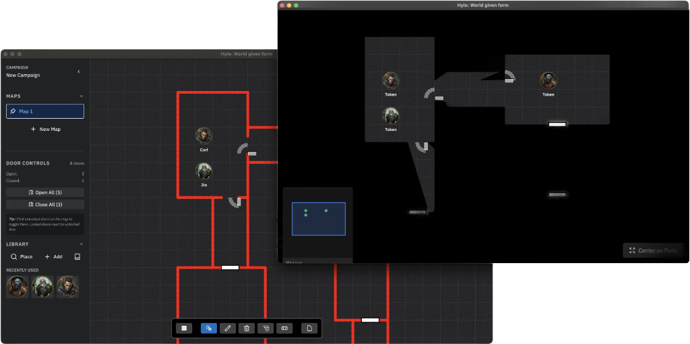

<br>

<div align="center">
  <picture>
    <source media="(prefers-color-scheme: dark)" srcset="public/branding/logo-dark.svg">
    <source media="(prefers-color-scheme: light)" srcset="public/branding/logo-light.svg">
    
  </picture>
</div>
<br>

<div align="center">

# GRAPHIUM
### *The Weight of Creation*


<!-- Coverage badge intentionally omitted from external services: coverage is tracked via Vitest (`npm run test:coverage`), but we avoid external coverage services to keep Graphium fully local-first. -->

[Quick Start](#quick-start) • [Philosophy](#philosophy) • [Tools](#tools) • [Installation](#installation) • [Contributing](#contributing)

</div>

---

> **Graphium** (Latin: a sharp stylus).
> A tool for **Tactile Cartography** that treats your world not as a slippery whiteboard, but as a permanent etching.

**Graphium** is a Virtual Tabletop designed for the **Dungeon Master who prefers weight over fluff.**
We believe map-making should feel like *carving* the unknown into existence. No cloud accounts. No subscriptions. No "slippery" controls. Just you, the stylus, and the infinite canvas.

**Pronunciation**: GRAF-ee-um
**Tagline**: "Inscribe the World."



---

<h2 id="philosophy">🏛 The Etched Philosophy</h2>

***"Whiteboards are for brainstorming. Graphium is for history."***

Most VTTs feel floaty and temporary. Graphium is built with **funicular friction**—a satisfying "bite" to every interaction that makes your choices feel deliberate.

- **From "Matter" to "Tool":** *Graphium* (the tool that shapes raw matter) reflects our focus on precision and craftsmanship.
- **The Wax Tablet:** Romans drafted on wax because it was durable yet correctable. We bring that same tactile decisiveness to your digital campaign.
- **Local Sovereignty:** Your world lives on *your* drive in sacred `.graphium` tomes. No cloud wizard can gaze upon your maps or hold your campaign hostage.

---

## 🎞️ Artifacts in Motion

*Observe the tool in action.*

<div align="center">
  
  
</div>

*(Placeholder: Real captures of the fog raycasting and window projection being forged.)*

---

<h2 id="quick-start">🚀 Quick Start Ritual</h2>

**TL;DR**: A local-first, dual-window VTT. Launch it, drag a map, and start carving walls.

```bash
# Summon the code
git clone https://github.com/kocheck/Graphium.git
cd Graphium

# Bind dependencies
npm install

# Awakening
npm run dev
```

**Your First Incantation:**
1. **Launch Graphium**.
2. **New Campaign** (`Cmd+N`).
3. **Drag & Drop** any map image onto the Iron Grid.
4. **Open World View**: Project this clean window to your players (or second monitor).
5. **Carve Fog**: Use the **Wall Tool (W)** to block line-of-sight.
6. **Inscribe**: Place tokens that reveal the map as they move.

---

<h2 id="tools">⚔️ The Tools of Creation</h2>

Graphium gives you a dedicated "Architect's View" full of arcane instruments, while your players see only the "World View"—a pristine projection of your reality.

### **The Stylus (Marker Tools)**
- **Etch (Draw)**: Annotate the map. Marks feel physical and permanent.
- **Inscribe (Tokens)**: Place characters and monsters.
- **Occlude (Walls)**: Draw dynamic light-blocking barriers.

### **The Tablet (System)**
- **Dual-Window Architecture**: One brain, two faces. You control the chaos; they witness the glory.
- **Fog of War**: A hardware-accelerated raycasting engine that creates true mystery.
- **Asset Conjuration**: Drag and drop images directly onto the canvas. We optimize them automatically.

---

## ⚒️ The Smithy (Composition)

Only the finest materials were used to forge Graphium.

- **[Electron](https://www.electronjs.org/)**: The crucible that holds the application.
- **[React](https://react.dev/)**: The logic that binds the interface.
- **[Konva](https://konvajs.org/)**: The renderer for our high-performance 2D canvas.
- **[Zustand](https://github.com/pmndrs/zustand)**: The enlightened state management.
- **[Vite](https://vitejs.dev/)**: The lightning-fast bellows that fuel development.

---

<h2 id="installation">🔨 The Forge (Installation)</h2>

### **Prerequisites**
- **Node.js** (v18+)
- **npm** (The package summoner)

### **Forging Instructions**

```bash
# 1. Claim the Source
git clone https://github.com/kocheck/Graphium.git

# 2. Enter the Workshop
cd Graphium

# 3. Gather Materials
npm install

# 4. Strike the Anvil (Dev Mode)
npm run dev

# 5. Final Polish (Production Build)
npm run build
```

---

## 📖 Keyboard Sigils (Shortcuts)

- **V**: Select / Manipulate
- **M**: Marker / Etch
- **E**: Eraser / Smooth Wax
- **W**: Wall / Occlude
- **D**: Door / Passage
- **I**: Color Picker
- **Cmd + S**: Save the Tome (.graphium)
- **Cmd + O**: Open a Tome
- **Shift + Drag**: Lock Axis

---

<h2 id="contributing">🤝 Join the Guild</h2>

We welcome fellow smiths to the forge. If you wish to improve the tool:

1. **Fork** the repository.
2. **Create a branch** (`git checkout -b feature/my-cool-spell`).
3. **Commit** (`git commit -m 'Cast a fireball'`).
4. **Push** (`git push origin feature/my-cool-spell`).
5. **Open a Pull Request**.

See [CONTRIBUTING.md](CONTRIBUTING.md) for the rules of engagement.

---

<div align="center">

**[⬆ Back to Top](#)**

Made with ⚔️ by [kocheck](https://github.com/kocheck)

</div>
